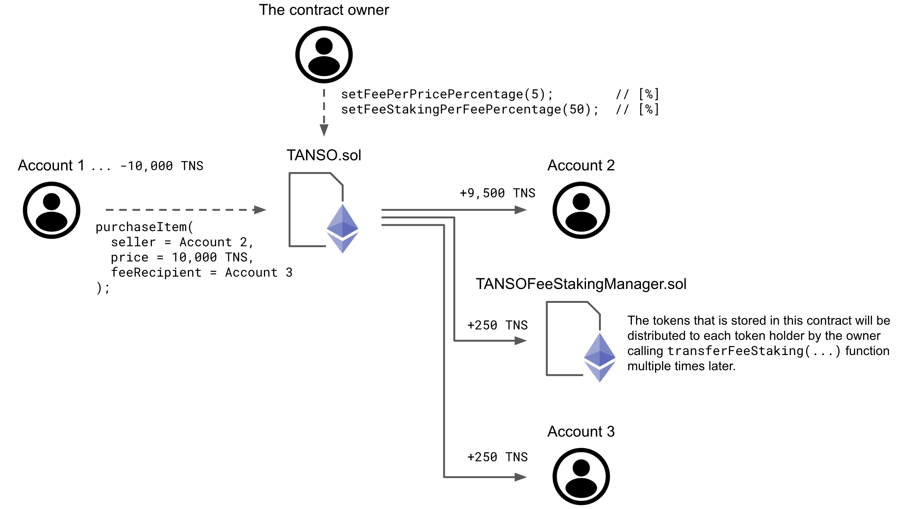

# TANSO

The governance token of [TanSoDAO](https://tansodao.io/).

## Table of Contents

- [Background](#background)
- [Specification](#specification)
- [Usage](#usage)
- [License](#license)

## Background

This repository contains the token contract, staking manager contracts, and safe math libraries.
All contracts can be upgraded by using [OpenZeppelin Upgrades Plugins](https://docs.openzeppelin.com/upgrades-plugins/1.x/).
* The token contract is inherited from [OpenZeppelin Upgradeable Contracts](https://github.com/OpenZeppelin/openzeppelin-contracts-upgradeable), and in charge of the basic ERC20 token tasks and carbon credit transactions on the TanSoDAO marketplace (calculating and transferring the fee etc.).
* The staking manager contracts are for storing and distributing the tokens for the staking.
* The safe math libraries take care of the bit tricky cases that [OpenZeppelin's SafeMathUpgradeable.sol](https://github.com/OpenZeppelin/openzeppelin-contracts-upgradeable/blob/master/contracts/utils/math/SafeMathUpgradeable.sol) doesn't cover such as `A * B / C`.

## Specification

### Basic staking

The basic staking manager contract is for storing the tokens for the basic staking.
The stored tokens are distributed from this contract to each token holder by the owner calling its transferring function multiple times.

The tokens for the basic staking will be stored by transferring from the owner to this contract.

### Fee staking

The fee staking manager contract is for storing the tokens for the fee staking.
The stored tokens are distributed from this contract to each token holder by the owner calling its transferring function multiple times.

Unlike the basic staking manager contract mentioned above, the tokens for the fee staking will be stored by a buyer purchasing a carbon credit on the TanSoDAO marketplace.
When a buyer purchases a carbon credit on the TanSoDAO marketplace, (the part of) the fee of that carbon credit transaction will be accumulated into this contract.
The figure below shows the relationship between the token contract and the fee staking manager contract (the numbers of the fee percentages in the figure are example numbers for simplification purpose).



1. The contract owner sets the "fee / price percentage = 4%" and "fee staking / fee percentage = 75%".
2. Account 1 (buyer) purchases a carbon credit on the TanSoDAO marketplace from Account 2 (seller) with the price of 1,000 TNS. The fee recipient can be specified other than the seller. In this case, it's Account 3.
3. The token contract transfers the Account 1's balance to:
    * Account 2 (seller): +9,600 TNS = 10,000 TNS - (0.04 * 1,000 TNS)
    * The fee staking manager: +300 TNS = 0.75 * (0.04 * 1,000 TNS)
    * Account 3 (fee recipient): +100 TNS = (0.04 * 1,000 TNS) - {0.75 * (0.04 * 1,000 TNS)}
4. The tokens stored in the fee staking manager contract will be distributed to each token holder by the contract owner later.

### Transfer mutex lock

There is a mutex lock flag for transferring, and any functions that involve transfer will fail during this boolean flag is true.
This flag can be set only by the owner, and is used mainly when calculating the amount of the tokens to be distributed to each token holder for the staking.

### Lock up of the owner's balance

There is lock up for the owner's balance. 
The lock up schedule is shown below.
The owner's balance cannot be lower than:
  * 30% of the token cap until Jan. 1st 2023 00:00:00 UTC
  * 25% of the token cap until Jan. 1st 2024 00:00:00 UTC
  * 20% of the token cap until Jan. 1st 2025 00:00:00 UTC
  * 15% of the token cap until Jan. 1st 2026 00:00:00 UTC
  * 10% of the token cap until Jan. 1st 2027 00:00:00 UTC
  *  5% of the token cap until Jan. 1st 2028 00:00:00 UTC

Note that the release timing may differ within few seconds due to the characteristic of "block.timestamp".
However, differing within few seconds is not a big issue for the purpose of the lock up.

## Usage

An example usage on the frontend is like below.

```javascript
const accounts = await window.ethereum.request({ method: 'eth_requestAccounts' });
const account = accounts[0];

const web3 = new Web3(window.ethereum);
const contract = new web3.eth.Contract(contractAbi, contractAddress);

// Get the token symbol.
// It should output "TNS".
let tokenSymbol;
contract.methods.symbol().call().then((result) => {
  tokenSymbol = result;
  console.log(tokenSymbol);
});

// Get the token decimals.
// It should output "18".
let tokenDecimals;
contract.methods.decimals().call().then((result) => {
  tokenDecimals = result;
  console.log(tokenDecimals);
});

// Get the token holders and their balances.
// It should output like "0xf39Fd6e51aad88F6F4ce6aB8827279cffFb92266: 100 TNS".
contract.methods.tokenHolderAddresses().call().then((result) => {
  const tokenHolderAddresses = result;
  for (let i = 0; i < tokenHolderAddresses.length; ++i) {
    contract.methods.balanceOf(tokenHolderAddresses[i]).call().then((result) => {
      const tokenHolderBalance = result;
      console.log(tokenHolderAddresses[i] + ": " + tokenHolderBalance / (10.0 ** tokenDecimals) + " " + tokenSymbol);
    });
  }
});

// Send a carbon credit transaction on the TanSoDAO marketplace by calling `purchaseItem()` function.
const purchaseItemForm = document.getElementById("purchaseItemForm");
purchaseItemForm.addEventListener("submit", event => {
  event.preventDefault();

  const seller = document.getElementById("purchaseItemSeller").value;
  const price = document.getElementById("purchaseItemPrice").value;
  const feeRecipient = document.getElementById("purchaseItemFeeRecipient").value;

  contract.methods.purchaseItem(seller, price, feeRecipient).send({from: account}).then((error, result) => {
    console.log(error);
    console.log(result);
  });
});
```

## License

[GNU Affero General Public License v3.0 or later](https://spdx.org/licenses/AGPL-3.0-or-later.html)
