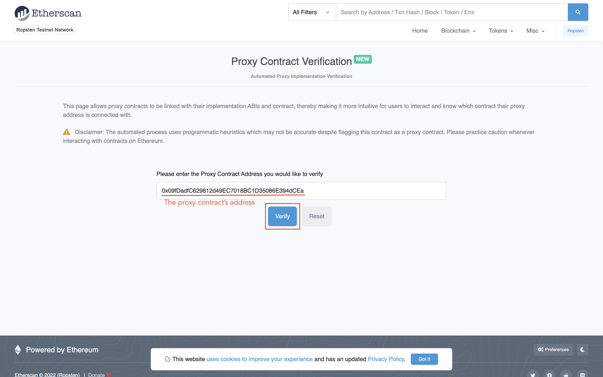

# TANSO development wiki

*NOTE: This document is written on Jan. 30th 2022.*


## 1. Overview

This document describes:
* how to setup the development environment
* how to "use" this project (unit test, deploy, upgrade, etc...)


## 2. Environment setup

This project has been developed with the following development tools, so we will install these tools in this section.
* Node.js
* Hardhat
* OpenZeppelin Upgrades Plugins
* OpenZeppelin Upgradeable Contracts

Basically, this section follows:
* [Hardhat tutorial](https://hardhat.org/tutorial/)
* [OpenZeppelin tutorial for Upgradeable contract by Transparent proxy (Old)](https://forum.openzeppelin.com/t/openzeppelin-upgrades-step-by-step-tutorial-for-hardhat/3580)
* [OpenZeppelin tutorial for Upgradeable contract by UUPS proxy (New)](https://forum.openzeppelin.com/t/uups-proxies-tutorial-solidity-javascript/7786)
* [OpenZeppelin tutorial for how to verify the contract code](https://forum.openzeppelin.com/t/how-to-verify-a-contract-on-etherscan-bscscan-polygonscan/14225)

To use Hardhat (which is a popular framework for smart contract development), we need to install Node.js first.
If your PC is macOS, `nvm` is recommended to install Node.js, rather than install it directly on the macOS.
Please check the latest installation method in https://github.com/nvm-sh/nvm.
```
$ curl -o- https://raw.githubusercontent.com/nvm-sh/nvm/v0.39.1/install.sh | bash
$ nvm install v16
$ nvm use v16
$ nvm alias default v16
```

Make sure that now the path of the `node` and `npm` command is like `/Users/xxx/.nvm/versions/node/v16.x.x/bin/`.
```
$ which node
$ which npm
```

Then, upgrade the `npm` to the latest version.
```
$ npm install npm --global
```

After Node.js is installed, now we will install Hardhat inside the project directory, not globally.
```
$ cd TANSO
$ npm init --yes
$ npm install --save-dev hardhat
```

Install additional packages that are necessary to develop smart contracts and unit tests in Hardhat.
```
$ npm install --save-dev @nomiclabs/hardhat-ethers ethers @nomiclabs/hardhat-waffle ethereum-waffle chai @nomiclabs/hardhat-etherscan
```

Finally, install additional packages for developing upgradeable contracts.
```
$ npm install --save-dev @openzeppelin/hardhat-upgrades @openzeppelin/contracts-upgradeable 
```


## 3. How to use

### 3-1. Directory structure

*NOTE: The directory structure below only shows important files.*

```
TANSO/
│
├── contracts/
│   └── library/
│       └── TANSOSafeMath_v1.sol
│       └── TANSOSafeMathTest_v1.sol
│   └── TANSO_v1.sol
│   └── TANSOBasicStakingManager_v1.sol
│   └── TANSOFeeStakingManager_v1.sol
│
├── frontend/
│   └── src/
│       └── contracts/
│           └── TANSO_v1_implementationContractAddress_xxx.json
│           └── TANSO_v1_proxyContractAddress_xxx.json
│           └── TANSO_v1.json
│           └── TANSOBasicStakingManager_v1_implementationContractAddress_xxx.json
│           └── TANSOBasicStakingManager_v1_proxyContractAddress_xxx.json
│           └── TANSOBasicStakingManager_v1.json
│           └── TANSOFeeStakingManager_v1_implementationContractAddress_xxx.json
│           └── TANSOFeeStakingManager_v1_proxyContractAddress_xxx.json
│           └── TANSOFeeStakingManager_v1.json
│
├── scripts/
│   ├── deployTANSO_v1.js
│   ├── deployTANSOBasicStakingManager_v1.js
│   ├── deployTANSOFeeStakingManager_v1.js
│   ├── upgradeToV2_sample.js
│   └── util.js
│
├── test/
│   └── library/
│       └── TANSOSafeMathTest_v1.js
│   └── TANSO_v1.js
│   └── TANSOBasicStakingManager_v1.js
│   └── TANSOFeeStakingManager_v1.js
│   └── util.js
│
├── hardhat.config.js
└── .key.json
```

* `TANSO_v1.sol` is the main contract that defines the ERC20 token.
* `TANSOBasicStakingManager_v1.sol` is a supplemental contract that manages the basic staking. The balance for the basic staking will be stored in this contract address.
* `TANSOFeeStakingManager_v1.sol` is a supplemental contract that manages the fee staking. The fee for the fee staking will be accumulated in this contract address.

### 3-2. Unit test

To test the contract program, use `hardhat` command followed by `test` task.
(Note that we need to add `npx` command before `hardhat` command because we installed Hardhat locally instead of globally)
```
$ npx hardhat test

  TANSOSafeMathTest_v1
    Calculation
      ✓ should calculate `A * B / C` safely

  TANSO_v1
    Deployment
      ✓ should set the owner correctly
      ✓ should set the mutex lock flag for transferring correctly
      ✓ should initialize the list of the token holder addresses correctly
      ✓ should mint the whole capped amount of the tokens to the owner
      ✓ should fail if the `msg.sender` is not owner (68ms)
    Transfer
      ✓ should transfer tokens and update the list of the token holder addresses correctly (56ms)
      ✓ should fail if the transfer is mutex locked by the owner (58ms)
      ✓ should fail if the owner's balance is still locked up (178ms)
    Transaction
      ✓ should calculate the fee correctly (66ms)
      ✓ should fail if the input argument of `purchaseItem()` is invalid
      ✓ should fail if the transfer is mutex locked by the owner (58ms)

  TANSOBasicStakingManager_v1
    Deployment
      ✓ should set the owner correctly
      ✓ should fail if the `msg.sender` is not owner
    Staking
      ✓ should transfer the fee staking correctly (49ms)

  TANSOFeeStakingManager_v1
    Deployment
      ✓ should set the owner correctly
      ✓ should fail if the `msg.sender` is not owner
    Staking
      ✓ should transfer the fee staking correctly (46ms)

  18 passing (4s)
```

### 3-3. Deploy to local testnet

To play around with the contract program interactively, we need to deploy the contract program to the local testnet, which is closed within your PC.

First, launch the local testnet in terminal1. 
```
### In terminal1

$ npx hardhat node

Started HTTP and WebSocket JSON-RPC server at http://127.0.0.1:8545/

Accounts
========

Account #0: 0xf39fd6... (10000 ETH)
Private Key: 0xac0974...

Account #1: 0x709979... (10000 ETH)
Private Key: 0x59c699...

...

Account #19: 0x8626f6... (10000 ETH)
Private Key: 0xdf5708...
```

Then switch to terminal2, and run the deploy scripts to deploy each contract program to the local testnet we launched in the above step.
The scripts will show both the proxy contract's address and the implementation contract's address, and these addresses and the contract ABI can be found in `TANSO/frontend/src/contracts/`.
Those files will be auto generated (and overwrite the old files) when running the deploy scripts.

*WARN: The order of running the deploy scripts is important! "deployTANSO_v1.js" should be executed in the last. Otherwise, the deployment will fail and your ETH will be lost.*

```
### In terminal2

### First, run "deployTANSOBasicStakingManager_v1.js"
$ npx hardhat run ./scripts/deployTANSOBasicStakingManager_v1.js --network localhost

Deploying (upgradeable) 'TANSOBasicStakingManager_v1' ...
'TANSOBasicStakingManager_v1' has been deployed.
    * Proxy address: 0xe7f1725E7734CE288F8367e1Bb143E90bb3F0512
   (* Implementation address: 0x5FbDB2315678afecb367f032d93F642f64180aa3)


### Then, run "deployTANSOFeeStakingManager_v1.js"
$ npx hardhat run ./scripts/deployTANSOFeeStakingManager_v1.js --network localhost

Deploying (upgradeable) 'TANSOFeeStakingManager_v1' ...
'TANSOFeeStakingManager_v1' has been deployed.
    * Proxy address: 0xCf7Ed3AccA5a467e9e704C703E8D87F634fB0Fc9
   (* Implementation address: 0x9fE46736679d2D9a65F0992F2272dE9f3c7fa6e0)


### Finally, run "deployTANSO_v1.js"
$ npx hardhat run ./scripts/deployTANSO_v1.js --network localhost

Deploying (upgradeable) 'TANSO_v1' ...
'TANSO_v1' has been deployed.
    * Proxy address: 0x5FC8d32690cc91D4c39d9d3abcBD16989F875707
   (* Implementation address: 0xDc64a140Aa3E981100a9becA4E685f962f0cF6C9)
```

Finally in terminal2, launch a console to interact with the contract program we deployed in the above step.
```
### In terminal2

$ npx hardhat console --network localhost

> const Token = await ethers.getContractFactory("TANSO_v1");
undefined

> const token = await Token.attach("0x5FC8d32690cc91D4c39d9d3abcBD16989F875707");
undefined

> await token.symbol();
'TNS'

> await token.tokenHolderAddresses();
[
  '0x5FC8d32690cc91D4c39d9d3abcBD16989F875707',
  '0xe7f1725E7734CE288F8367e1Bb143E90bb3F0512',
  '0xCf7Ed3AccA5a467e9e704C703E8D87F634fB0Fc9',
  '0xf39Fd6e51aad88F6F4ce6aB8827279cffFb92266'
]

> await token.owner();
'0xf39Fd6e51aad88F6F4ce6aB8827279cffFb92266'

> await token.balanceOf("0xf39Fd6e51aad88F6F4ce6aB8827279cffFb92266");
BigNumber { value: "1000000000000000000000000000" }

> await token.feePerPricePercentage();
BigNumber { value: "2" }

> await token.feeStakingPerFeePercentage();
BigNumber { value: "50" }

> 
```

*NOTE: `Ctrl + D` to exit the console.*

### 3-4. Deploy to real testnet

To deploy to a real testnet such as Ropsten, we need 2 things.
* API key of [Alchemy](https://www.alchemy.com/) (or [Infura](https://infura.io/)) for Ropsten
* Private key of the wallet (it can be found in Metamask)

*NOTE: To export your private key from Metamask, go to "Account details" --> "Export Private Key".
Make sure that your Metamask has enough Ropsten-ETH (you can obtain it for free from Ropsten faucet like [here](https://faucet.ropsten.be/)).*


And to verify the deployed contract code, we need another thing.
* API key of [Etherscan](https://etherscan.io/)

Write these 3 keys into the hidden file named ".key.json".
```json
{
  "ropstenAlchemyApiKey" : "Tv8Ebm...",
  "privateKey": "72c916...",
  "etherscanApiKey": "61X7CV..."
}
```

Then, run the deploy scripts to deploy each contract program to the real testnet.
It would take few minutes due to the mining of the deployment transaction.

*WARN: Again, the order of running the deploy scripts is important! "deployTANSO_v1.js" should be executed in the last. Otherwise, the deployment will fail and your ETH will be lost.*

```
### First, run "deployTANSOBasicStakingManager_v1.js"
$ npx hardhat run ./scripts/deployTANSOBasicStakingManager_v1.js --network ropsten

Deploying (upgradeable) 'TANSOBasicStakingManager_v1' ...
'TANSOBasicStakingManager_v1' has been deployed.
    * Proxy address: 0xE4a8913cc4C56320Ed6fF0681c20b04D813bCD5f
   (* Implementation address: 0x4D1A513B7A4771a05AF5398Bc8dc5AbF1468D3fE)


### Then, run "deployTANSOFeeStakingManager_v1.js"
$ npx hardhat run ./scripts/deployTANSOFeeStakingManager_v1.js --network localhost

Deploying (upgradeable) 'TANSOFeeStakingManager_v1' ...
'TANSOFeeStakingManager_v1' has been deployed.
    * Proxy address: 0x89642b2C209A0393F50d0b2f7394Ee89f5cC2081
   (* Implementation address: 0x5207C66ebf843805505BdFCcfb8B17e538Ce8394)


### Finally, run "deployTANSO_v1.js"
$ npx hardhat run ./scripts/deployTANSO_v1.js --network localhost

Deploying (upgradeable) 'TANSO_v1' ...
'TANSO_v1' has been deployed.
    * Proxy address: 0x09fDadfC629812d49EC7018BC1D35086E394dCEa
   (* Implementation address: 0xBEB1C9E611c36fB3eC74131BE971862388eE274B)
```

You can find and check the deployed contract in
* Basic staking manager contract: https://ropsten.etherscan.io/address/0xE4a8913cc4C56320Ed6fF0681c20b04D813bCD5f
* Fee staking manager contract: https://ropsten.etherscan.io/address/0x89642b2C209A0393F50d0b2f7394Ee89f5cC2081
* Token contract: https://ropsten.etherscan.io/address/0x09fDadfC629812d49EC7018BC1D35086E394dCEa

Also, you can interact with it via console.
```
$ npx hardhat console --network ropsten

> const Token = await ethers.getContractFactory("TANSO_v1");
undefined

> const token = await Token.attach("0x09fDadfC629812d49EC7018BC1D35086E394dCEa");
undefined

> await token.symbol();
'TNS'

> await token.tokenHolderAddresses();
[
  '0x09fDadfC629812d49EC7018BC1D35086E394dCEa',
  '0xE4a8913cc4C56320Ed6fF0681c20b04D813bCD5f',
  '0x89642b2C209A0393F50d0b2f7394Ee89f5cC2081',
  '0xCcf97197c68718Af777Cf4204Bee72eB391B16bF'
]

> await token.owner();
'0xCcf97197c68718Af777Cf4204Bee72eB391B16bF'

> await token.balanceOf("0xCcf97197c68718Af777Cf4204Bee72eB391B16bF");
BigNumber { value: "1000000000000000000000000000" }

> await token.feePerPricePercentage();
BigNumber { value: "2" }

> await token.feeStakingPerFeePercentage();
BigNumber { value: "50" }

> 
```

After deployed the contract programs on the public network, the next step would be to verify the deployed contract code.
We can verify the deployed contract code on Etherscan using Hardhat (See [this Hardhat tutorial](https://hardhat.org/plugins/nomiclabs-hardhat-etherscan.html) and [this OpenZeppelin tutorial](https://forum.openzeppelin.com/t/how-to-verify-a-contract-on-etherscan-bscscan-polygonscan/14225) for the details).

*NOTE: For upgradeable contracts, we need to verify the implementation contracts instead of the proxy contracts, and no need to provide the constructor arguments (the arguments of `initialize()` function) in `npx hardhat verify` command. See [this section](https://forum.openzeppelin.com/t/how-to-verify-a-contract-on-etherscan-bscscan-polygonscan/14225#upgradeable-contracts-and-proxies-11) in the OpenZeppelin tutorial mentioned above.*

```
### Note that "0xBEB1C9...8eE274B" is the implementation contract's address, not the proxy contract's address.

$ npx hardhat verify 0xBEB1C9E611c36fB3eC74131BE971862388eE274B --network ropsten

Nothing to compile
Compiling 1 file with 0.8.4
Successfully submitted source code for contract
contracts/TANSO_v1.sol:TANSO_v1 at 0xBEB1C9E611c36fB3eC74131BE971862388eE274B
for verification on the block explorer. Waiting for verification result...

Successfully verified contract TANSO_v1 on Etherscan.
https://ropsten.etherscan.io/address/0xBEB1C9E611c36fB3eC74131BE971862388eE274B#code
```





### 3-5. Deploy to Ethereum mainnet

Similar to [3-4. Deploy to real testnet](#3-4-deploy-to-real-testnet).

### 3-6. Upgrade the contract program

First, modify "TANSO_v1.sol" and name it "TANSO_v2.sol".

*WARN: There are some limitations when upgrading contract programs. You must be careful about this. See here: [OpenZeppelin - Limitations of contract upgrades](https://docs.openzeppelin.com/learn/upgrading-smart-contracts#limitations-of-contract-upgrades).*

Then, run the upgrade script to upgrade the contract program that is already deployed in the network.
```
$ npx hardhat run ./scripts/upgradeToV2.js --network localhost

Upgrading to 'TANSOBasicStakingManager_v2' ...
'TANSOBasicStakingManager_v2' has been upgraded.
    * Proxy address: 0xe7f1725E7734CE288F8367e1Bb143E90bb3F0512
   (* Implementation address: 0x5FbDB2315678afecb367f032d93F642f64180aa3)

Upgrading to 'TANSOFeeStakingManager_v2' ...
'TANSOFeeStakingManager_v2' has been upgraded.
    * Proxy address: 0xCf7Ed3AccA5a467e9e704C703E8D87F634fB0Fc9
   (* Implementation address: 0x9fE46736679d2D9a65F0992F2272dE9f3c7fa6e0)

Upgrading to 'TANSO_v2' ...
'TANSO_v2' has been upgraded.
    * Proxy address: 0x5FC8d32690cc91D4c39d9d3abcBD16989F875707
   (* Implementation address: 0xDc64a140Aa3E981100a9becA4E685f962f0cF6C9)
```

Make sure that the v2's proxy contract address is not changed from v1 (which is awesome).
